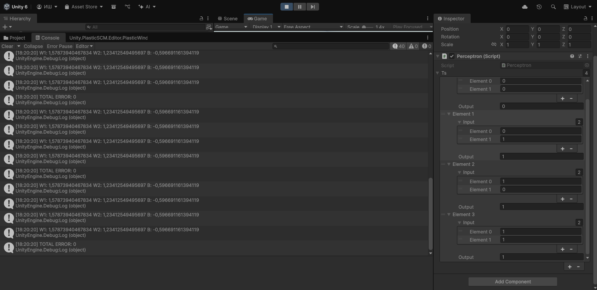
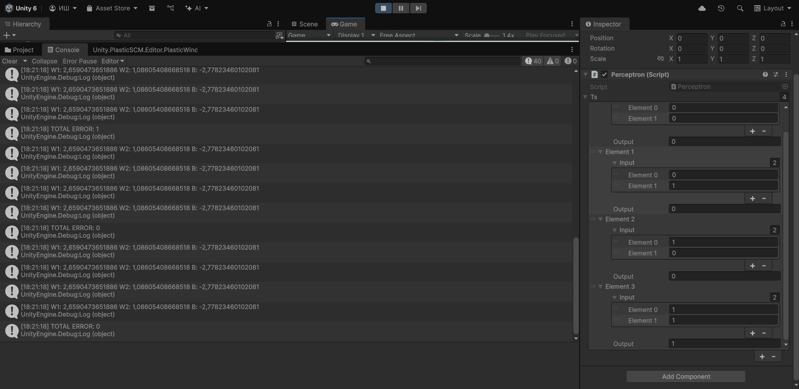
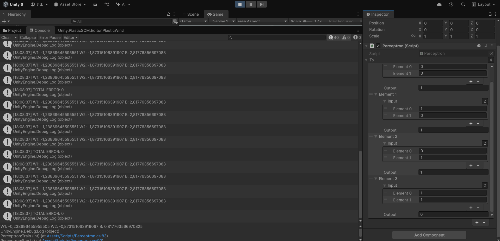
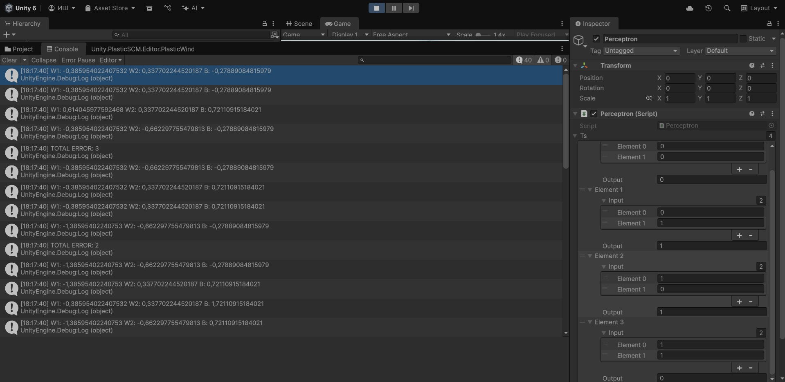
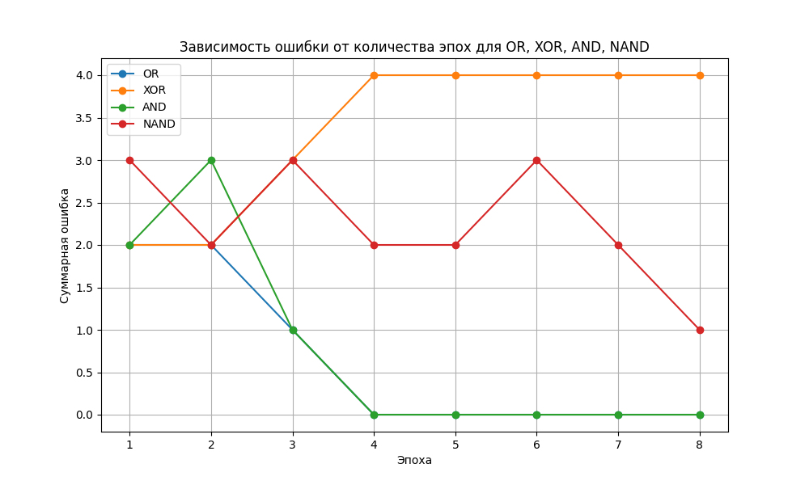

# АНАЛИЗ ДАННЫХ И ИСКУССТВЕННЫЙ ИНТЕЛЛЕКТ [in GameDev]
Отчет по лабораторной работе #4 выполнил(а):
- Макаридин Матвей Алексеевич
- НМТ-333719
Отметка о выполнении заданий (заполняется студентом):

| Задание | Выполнение | Баллы |
| ------ | ------ | ------ |
| Задание 1 | * | 60 |
| Задание 2 | * | 20 |
| Задание 3 | # | 20 |

знак "*" - задание выполнено; знак "##" - задание не выполнено;

Работу проверили:
- к.т.н., доцент Денисов Д.В.
- к.э.н., доцент Панов М.А.
- ст. преп., Фадеев В.О.

[](https://nodesource.com/products/nsolid)

[](https://travis-ci.org/joemccann/dillinger)


## Цель работы
Изучить модель персептрона с помощью Unity. Реализовать персептрон в Unity таким образом, чтобы он умел производить логические вычесления.

## Задание 1
### В новом проекте Unity реализовать перцептрон, умеющий производить вычисления
- OR   0+0=0 0+1=1 1+0=1 1+1=1
- AND  0+0=0 0+1=0 1+0=0 1+1=1
- NAND 0+0=1 0+1=1 1+0=1 1+1=0
- XOR  0+0=0 0+1=1 1+0=1 1+1=0

### OR


### AND


### NAND


### XOR


### Скрипт перцептрона
```C#
using System.Collections;
using System.Collections.Generic;
using UnityEngine;
using System.IO;

[System.Serializable]
public class TrainingSet
{
    public double[] input;
    public double output;
}

public class Perceptron : MonoBehaviour
{
    public TrainingSet[] ts;
    double[] weights = { 0, 0 };
    double bias = 0;
    double totalError = 0;
    List<double> epochErrors = new List<double>();

    double DotProductBias(double[] v1, double[] v2)
    {
        if (v1 == null || v2 == null)
            return -1;

        if (v1.Length != v2.Length)
            return -1;

        double d = 0;
        for (int x = 0; x < v1.Length; x++)
        {
            d += v1[x] * v2[x];
        }

        d += bias;

        return d;
    }

    double CalcOutput(int i)
    {
        double dp = DotProductBias(weights, ts[i].input);
        if (dp > 0) return 1;
        return 0;
    }

    void InitialiseWeights()
    {
        for (int i = 0; i < weights.Length; i++)
        {
            weights[i] = Random.Range(-1.0f, 1.0f);
        }
        bias = Random.Range(-1.0f, 1.0f);
    }

    void UpdateWeights(int j)
    {
        double error = ts[j].output - CalcOutput(j);
        totalError += Mathf.Abs((float)error);
        for (int i = 0; i < weights.Length; i++)
        {
            weights[i] = weights[i] + error * ts[j].input[i];
        }
        bias += error;
    }

    double CalcOutput(double i1, double i2)
    {
        double[] inp = new double[] { i1, i2 };
        double dp = DotProductBias(weights, inp);
        if (dp > 0) return 1;
        return 0;
    }

    void Train(int epochs)
    {
        InitialiseWeights();
        epochErrors.Clear();

        for (int e = 0; e < epochs; e++)
        {
            totalError = 0;
            for (int t = 0; t < ts.Length; t++)
            {
                UpdateWeights(t);
                Debug.Log("W1: " + weights[0] + " W2: " + weights[1] + " B: " + bias);
            }
            epochErrors.Add(totalError);
            Debug.Log("Epoch: " + (e + 1) + " TOTAL ERROR: " + totalError);
        }

        string path = Application.dataPath + "/epoch_errors.txt";
        using (StreamWriter writer = new StreamWriter(path))
        {
            foreach (double error in epochErrors)
            {
                writer.WriteLine(error);
            }
        }
        Debug.Log("Errors saved to: " + path);
    }

    void Start()
    {
        Train(8);
        /*
        Debug.Log("Test 0 0: " + CalcOutput(0,0));
        Debug.Log("Test 0 1: " + CalcOutput(0,1));
        Debug.Log("Test 1 0: " + CalcOutput(1,0));
        Debug.Log("Test 1 1: " + CalcOutput(1,1));
        */
    }

    void Update()
    {
    }
}
```

## Задание 2
### Построить графики зависимости количества эпох от ошибки обучения. Указать, от чего зависит необходимое количество эпох обучения 
Я вывел все полученные результаты в txt файл по каждой логике и объеденил их в график с помощью Python. Проанализировав данные для каждой логики, была выявлена зависимость скорости обучения от эпохи. 
Для логик OR, AND  персептрон к 4 эпохе перестает делать ошибки, NAND приближен на 8 эпохе к безошибочному результату а логика XOR с ростом количества эпох не перестает совершать ошибки.



```Python
import matplotlib.pyplot as plt

def read_errors(filename):
    errors = []
    try:
        with open(filename, 'r') as file:
            for line in file:
                errors.append(float(line.strip()))
    except FileNotFoundError:
        print(f"Файл {filename} не найден")
        return []
    return errors

datasets = {
    'OR': read_errors('OR.txt'),
    'XOR': read_errors('XOR.txt'),
    'AND': read_errors('AND.txt'),
    'NAND': read_errors('NAND.txt')
}

max_epochs = max(len(errors) for errors in datasets.values() if errors)

plt.figure(figsize=(10, 6))
for label, errors in datasets.items():
    if errors:
        plt.plot(range(1, len(errors) + 1), errors, marker='o', label=label)

plt.xlabel('Эпоха')
plt.ylabel('Суммарная ошибкаa')
plt.title('Зависимость ошибки от количества эпох для OR, XOR, AND, NAND')
plt.grid(True)
plt.legend()
plt.show()
```


## Выводы
В ходе работы были изучены логические операции: OR(Логическое сложение), AND(Логическое умножение), NAND(Логическое умножение с отрицанием) и XOR(Исключающая логическая сумма). На основе этих логик был реализован Персептрон, позволящий визуализировать их работу.

| Plugin | README |
| ------ | ------ |
| Dropbox | [plugins/dropbox/README.md][PlDb] |
| GitHub | [plugins/github/README.md][PlGh] |
| Google Drive | [plugins/googledrive/README.md][PlGd] |
| OneDrive | [plugins/onedrive/README.md][PlOd] |
| Medium | [plugins/medium/README.md][PlMe] |
| Google Analytics | [plugins/googleanalytics/README.md][PlGa] |

## Powered by

**BigDigital Team: Denisov | Fadeev | Panov**
